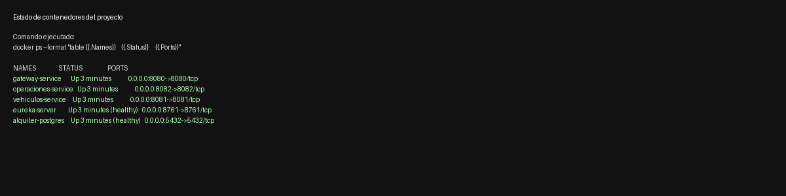
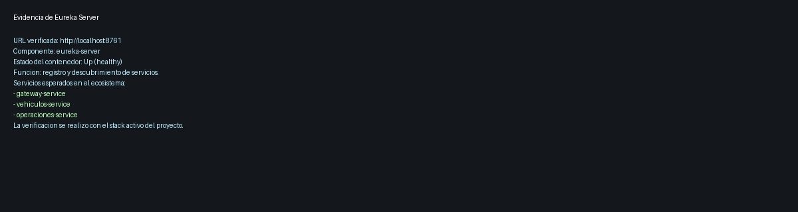
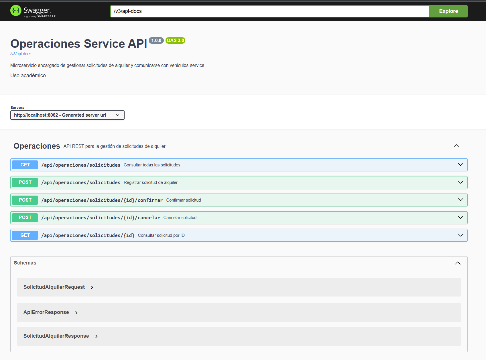
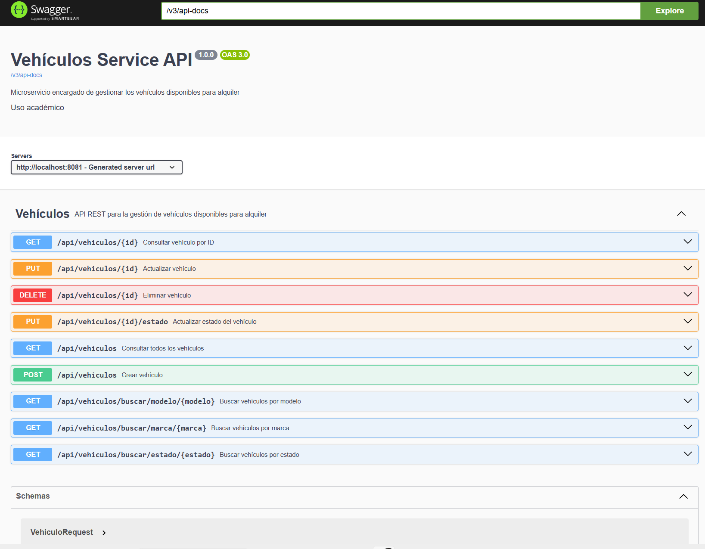

# Portada

**Asignatura:** Desarrollo Web Full Stack  
**Título:** Desarrollo de un Sistema de Gestión de Alquiler de Vehículos  
**Tipo de entrega:** Memoria académica del backend  
**Alumno:** ____________________  
**Fecha:** 05 de mayo de 2026  

---

# Índice

1. Introducción  
2. Infraestructura del sistema  
3. Microservicio "vehículos"  
4. Microservicio "operaciones"  
5. Validación práctica del backend  
6. Conclusiones  
7. Referencias bibliográficas  

---

# 1. Introducción

El presente proyecto tiene como objetivo diseñar e implementar exclusivamente el Backend de un sistema de gestión de alquiler de vehículos, aplicando una arquitectura basada en microservicios. La solución propuesta permite administrar vehículos disponibles para alquiler y gestionar solicitudes de alquiler mediante servicios independientes, comunicados entre sí a través de mecanismos de descubrimiento de servicios.

La temática de alquiler de vehículos fue seleccionada porque permite modelar un caso académico claro, donde se distinguen de forma natural dos responsabilidades principales: la gestión del inventario de vehículos y la gestión de las operaciones de alquiler. Esta separación facilita el análisis de las responsabilidades del Backend y demuestra el valor de una arquitectura distribuida.

El Backend es una pieza fundamental del sistema porque concentra la lógica de negocio, la persistencia de datos, la validación de reglas y la exposición de APIs REST para el consumo por parte de clientes externos. En este proyecto no se desarrolla frontend, ya que el enfoque se centra en el diseño, implementación y documentación de la capa servidor.

La arquitectura de microservicios aporta ventajas importantes para esta solución. En primer lugar, separa responsabilidades, de modo que el microservicio de vehículos se ocupa exclusivamente de la gestión del catálogo y del estado de disponibilidad, mientras que el microservicio de operaciones administra las solicitudes de alquiler. En segundo lugar, permite escalabilidad y mantenibilidad, ya que cada servicio puede evolucionar de forma independiente. Finalmente, con el uso de Eureka y Gateway se incorpora un modelo más cercano a escenarios reales de desarrollo Backend distribuido.

---

# 2. Infraestructura del sistema

La infraestructura del proyecto fue diseñada para responder directamente a los requerimientos iniciales de la actividad, los cuales exigían un backend basado en microservicios, persistencia relacional, un servidor de descubrimiento de servicios, un gateway de entrada y despliegue contenerizado.

La solución implementada se compone de los siguientes elementos:

- `vehiculos-service`, encargado de gestionar el catálogo de vehículos.
- `operaciones-service`, encargado de gestionar las solicitudes de alquiler.
- `eureka-server`, utilizado como registro y descubrimiento de servicios.
- `gateway-service`, utilizado como punto único de entrada al backend.
- `PostgreSQL`, como motor de persistencia relacional.
- `Docker Compose`, como mecanismo de orquestación local.
- `JMeter`, incorporado para validar funcionalidad y comportamiento bajo carga.

Todos los componentes se ejecutan dentro de contenedores Docker y se comunican a través de una red compartida. Esta decisión facilita la portabilidad, la reproducibilidad del entorno y la organización modular del backend.

## 2.1 Descripción de la infraestructura

### Servidor Eureka
El servidor Eureka permite el registro automático de los microservicios al iniciar y facilita la localización lógica de los servicios dentro del ecosistema backend.

### API Gateway
El Gateway recibe las peticiones del cliente y las enruta a los microservicios mediante las rutas `/api/vehiculos/**` y `/api/operaciones/**`, evitando el acceso directo del cliente a cada servicio interno.

### Persistencia con PostgreSQL
La solución utiliza PostgreSQL como base de datos relacional. Dentro del mismo motor se gestionan dos bases separadas por contexto funcional:

- `vehiculosdb`
- `operacionesdb`

Esta organización conserva la separación lógica entre dominios y cumple el requerimiento de persistencia estructurada.

### Orquestación con Docker Compose
El archivo `docker-compose.yml` coordina el despliegue de los contenedores del sistema, permitiendo levantar toda la infraestructura local con una única instrucción.

### JMeter como soporte de validación
Aunque no fue un requisito obligatorio del enunciado, se integró JMeter como herramienta de pruebas técnicas para fortalecer la validación del backend. Su uso permitió comprobar el funcionamiento real de los endpoints y ejecutar una prueba de carga básica sobre el Gateway.

## 2.2 Flujo lógico de la infraestructura

```text
Cliente externo
   |
   v
Gateway Service (8080)
   |
   |-------------> vehiculos-service (8081)
   |
   |-------------> operaciones-service (8082)
                           |
                           v
                  validación de vehículo
                           |
                           v
                  vehiculos-service (8081)

Eureka Server (8761)
- registra gateway-service
- registra vehiculos-service
- registra operaciones-service

PostgreSQL (5432)
- vehiculosdb
- operacionesdb

JMeter
- ejecuta pruebas funcionales
- ejecuta pruebas de carga
- genera reportes de resultados
```

La infraestructura descrita no solo cumple los componentes exigidos por la práctica, sino que además aporta evidencia de validación técnica del sistema completo.

---

# 3. Microservicio "vehículos"

## 2.1 Responsabilidad del microservicio

El microservicio `vehiculos-service` es responsable de gestionar la base de datos de vehículos disponibles para alquiler. Su función principal es ofrecer un CRUD completo de vehículos, además de métodos de búsqueda por marca, modelo y estado del vehículo.

## 2.2 Entidad principal

La entidad principal del servicio es `Vehiculo`, con los siguientes atributos:

- `id`: identificador único del vehículo.
- `marca`: marca del vehículo.
- `modelo`: modelo del vehículo.
- `placa`: placa del vehículo.
- `estado`: estado del vehículo (`DISPONIBLE` o `NO_DISPONIBLE`).
- `anio`: año del vehículo.
- `tipo`: tipo de vehículo.
- `createdAt`: fecha de creación del registro.
- `updatedAt`: fecha de actualización del registro.

## 2.3 Persistencia en base de datos relacional

Este microservicio utiliza PostgreSQL como base de datos relacional, cumpliendo con el requerimiento de persistencia estructurada. La tabla `vehiculos` almacena los registros administrados por el sistema.

## 2.4 Endpoints REST

### Crear vehículo
- **Endpoint:** `POST /api/vehiculos`
- **Método HTTP:** `POST`
- **Descripción:** registra un nuevo vehículo.

**Ejemplo de solicitud**
```json
{
  "marca": "Toyota",
  "modelo": "Corolla",
  "placa": "ABC123",
  "estado": "DISPONIBLE"
}
```

**Ejemplo de respuesta**
```json
{
  "id": 1,
  "marca": "Toyota",
  "modelo": "Corolla",
  "placa": "ABC123",
  "estado": "DISPONIBLE",
  "anio": null,
  "tipo": null,
  "createdAt": "2026-05-04T22:00:00",
  "updatedAt": "2026-05-04T22:00:00"
}
```

**Código de estado:** `201 Created`

### Consultar todos los vehículos
- **Endpoint:** `GET /api/vehiculos`
- **Método HTTP:** `GET`
- **Descripción:** retorna la lista completa de vehículos.
- **Código de estado:** `200 OK`

### Consultar vehículo por ID
- **Endpoint:** `GET /api/vehiculos/{id}`
- **Método HTTP:** `GET`
- **Parámetro:** `id` del vehículo.
- **Descripción:** consulta un vehículo específico.
- **Códigos de estado:** `200 OK`, `404 Not Found`

### Actualizar vehículo
- **Endpoint:** `PUT /api/vehiculos/{id}`
- **Método HTTP:** `PUT`
- **Descripción:** actualiza todos los datos del vehículo.
- **Códigos de estado:** `200 OK`, `400 Bad Request`, `404 Not Found`

### Eliminar vehículo
- **Endpoint:** `DELETE /api/vehiculos/{id}`
- **Método HTTP:** `DELETE`
- **Descripción:** elimina un vehículo del sistema.
- **Código de estado:** `204 No Content`

## 2.5 Métodos de búsqueda

### Buscar por marca
- **Endpoint:** `GET /api/vehiculos/buscar/marca/{marca}`
- **Método HTTP:** `GET`
- **Descripción:** retorna todos los vehículos que coinciden con la marca indicada.

### Buscar por modelo
- **Endpoint:** `GET /api/vehiculos/buscar/modelo/{modelo}`
- **Método HTTP:** `GET`
- **Descripción:** retorna todos los vehículos que coinciden con el modelo indicado.

### Buscar por estado
- **Endpoint:** `GET /api/vehiculos/buscar/estado/{estado}`
- **Método HTTP:** `GET`
- **Descripción:** retorna los vehículos en estado `DISPONIBLE` o `NO_DISPONIBLE`.

**Ejemplo de solicitud**
```http
GET /api/vehiculos/buscar/estado/DISPONIBLE
```

**Ejemplo de respuesta**
```json
[
  {
    "id": 1,
    "marca": "Toyota",
    "modelo": "Corolla",
    "placa": "ABC123",
    "estado": "DISPONIBLE"
  }
]
```

## 3.6 Actualización de estado del vehículo

- **Endpoint:** `PUT /api/vehiculos/{id}/estado`
- **Método HTTP:** `PUT`
- **Descripción:** cambia el estado del vehículo. Este endpoint es utilizado especialmente por `operaciones-service` cuando se confirma o cancela un alquiler.

**Ejemplo de solicitud**
```json
{
  "estado": "NO_DISPONIBLE"
}
```

## 3.7 Manejo de errores

El microservicio incluye manejo de errores para los siguientes casos:

- Vehículo no encontrado.
- Datos inválidos.
- Estado inválido.
- Errores de persistencia.
- Solicitudes mal formadas.

Los códigos de estado utilizados son:

- `200 OK`
- `201 Created`
- `204 No Content`
- `400 Bad Request`
- `404 Not Found`
- `500 Internal Server Error`

---

# 4. Microservicio "operaciones"

## 4.1 Responsabilidad del microservicio

El microservicio `operaciones-service` se encarga de gestionar las solicitudes de alquiler. Entre sus responsabilidades se encuentran registrar solicitudes, validarlas mediante consultas al microservicio `vehiculos-service`, confirmar alquileres, actualizar el estado del vehículo y cancelar solicitudes.

## 4.2 Independencia respecto a la base de datos de vehículos

Este microservicio no interactúa directamente con la base de datos del microservicio de vehículos. Para obtener información del vehículo y para actualizar su estado, realiza peticiones HTTP al microservicio `vehiculos-service` usando OpenFeign y el nombre del servicio registrado en Eureka (`vehiculos-service`).

Además, `operaciones-service` posee su propia persistencia relacional en PostgreSQL para almacenar las solicitudes de alquiler, cumpliendo así con la separación de responsabilidades.

## 4.3 Modelo de solicitud de alquiler

La entidad `SolicitudAlquiler` incluye los siguientes campos:

- `id`
- `vehiculoId`
- `nombreCliente`
- `documentoCliente`
- `fechaInicio`
- `fechaFin`
- `estadoSolicitud`
- `createdAt`
- `updatedAt`

Los estados permitidos son:

- `PENDIENTE`
- `CONFIRMADA`
- `CANCELADA`

## 4.4 Endpoints REST

### Registrar solicitud de alquiler
- **Endpoint:** `POST /api/operaciones/solicitudes`
- **Método HTTP:** `POST`
- **Descripción:** registra una solicitud de alquiler verificando previamente que el vehículo exista y esté disponible.

**Ejemplo de solicitud**
```json
{
  "vehiculoId": 1,
  "nombreCliente": "Cliente de prueba",
  "documentoCliente": "123456789",
  "fechaInicio": "2026-05-10",
  "fechaFin": "2026-05-15"
}
```

**Ejemplo de respuesta**
```json
{
  "id": 1,
  "vehiculoId": 1,
  "nombreCliente": "Cliente de prueba",
  "documentoCliente": "123456789",
  "fechaInicio": "2026-05-10",
  "fechaFin": "2026-05-15",
  "estadoSolicitud": "PENDIENTE"
}
```

**Códigos de estado:** `201 Created`, `400 Bad Request`, `404 Not Found`

### Consultar solicitudes
- **Endpoint:** `GET /api/operaciones/solicitudes`
- **Método HTTP:** `GET`
- **Descripción:** lista todas las solicitudes registradas.

### Consultar solicitud por ID
- **Endpoint:** `GET /api/operaciones/solicitudes/{id}`
- **Método HTTP:** `GET`
- **Descripción:** obtiene el detalle de una solicitud de alquiler.

### Confirmar solicitud
- **Endpoint:** `POST /api/operaciones/solicitudes/{id}/confirmar`
- **Método HTTP:** `POST`
- **Descripción:** valida nuevamente la disponibilidad del vehículo consultando `vehiculos-service`. Si el vehículo está disponible, confirma la solicitud y actualiza el vehículo a estado `NO_DISPONIBLE`.

**Resultado esperado:**
- La solicitud pasa a estado `CONFIRMADA`.
- El vehículo cambia a `NO_DISPONIBLE`.

### Cancelar solicitud
- **Endpoint:** `POST /api/operaciones/solicitudes/{id}/cancelar`
- **Método HTTP:** `POST`
- **Descripción:** cancela una solicitud. Si la solicitud estaba confirmada, el sistema actualiza el vehículo a estado `DISPONIBLE`.

**Resultado esperado:**
- La solicitud pasa a estado `CANCELADA`.
- Si estaba confirmada, el vehículo puede volver a estar disponible.

## 4.5 Validación obligatoria

Cuando se registra o confirma una solicitud, el flujo implementado es el siguiente:

1. `operaciones-service` consulta al microservicio `vehiculos-service`.
2. Verifica que el vehículo exista.
3. Verifica que el estado del vehículo sea `DISPONIBLE`.
4. Si está disponible, permite confirmar el alquiler.
5. Al confirmar, cambia el estado del vehículo a `NO_DISPONIBLE`.
6. Si el vehículo no está disponible, rechaza la operación con un error claro.

## 4.6 Comunicación entre microservicios

La comunicación entre microservicios se realiza mediante OpenFeign utilizando el nombre lógico del servicio `vehiculos-service`, registrado en Eureka. De este modo, `operaciones-service` consulta la información del vehículo y solicita la actualización de su estado sin acceder directamente a la base de datos del dominio de vehículos.

Este enfoque responde al requerimiento de separación de responsabilidades y mantiene una arquitectura coherente con el modelo de descubrimiento de servicios planteado en la práctica.

## 4.7 Manejo de errores

El microservicio maneja errores relacionados con:

- Solicitud no encontrada.
- Vehículo no encontrado.
- Vehículo no disponible.
- Fechas inválidas.
- Confirmación o cancelación no permitida.
- Errores de integración con el microservicio de vehículos.

Los códigos de estado utilizados son:

- `200 OK`
- `201 Created`
- `400 Bad Request`
- `404 Not Found`
- `500 Internal Server Error`

---

# 5. Validación práctica del backend

Con el objetivo de comprobar que la infraestructura y los microservicios respondieran correctamente en un entorno real, se ejecutaron pruebas funcionales directas sobre el backend desplegado y pruebas automatizadas con JMeter.

## 5.1 Pruebas funcionales realizadas

Se verificaron satisfactoriamente los siguientes casos:

- creación de vehículos
- consulta general y por identificador
- búsquedas por marca, modelo y estado
- creación de solicitudes de alquiler
- confirmación de solicitudes
- cancelación de solicitudes
- validación de error por placa duplicada
- validación de fechas inválidas
- rechazo de solicitudes sobre vehículos no disponibles
- manejo de recursos inexistentes

Estas pruebas confirmaron que el flujo principal del sistema funciona correctamente y que la integración entre `vehiculos-service` y `operaciones-service` opera de manera consistente a través del Gateway.

## 5.2 Evidencias visuales de la validación

Como soporte adicional de la entrega, se generaron evidencias visuales del estado de la infraestructura y de los servicios expuestos por el backend.

### Contenedores del proyecto


La captura anterior evidencia que los contenedores principales del sistema (`alquiler-postgres`, `eureka-server`, `gateway-service`, `vehiculos-service` y `operaciones-service`) se encontraban activos al momento de la verificación.

### Eureka Server


La evidencia de Eureka permite documentar el componente encargado del registro y descubrimiento de servicios dentro de la arquitectura de microservicios.

### Swagger de los microservicios




Estas evidencias complementan la validación técnica al mostrar la disponibilidad de la documentación interactiva de los microservicios.

## 5.3 Pruebas con JMeter

Como complemento de la validación funcional, se incorporó JMeter para automatizar la comprobación del backend.

### Smoke test funcional
Se ejecutó un plan de prueba con las siguientes operaciones:
- consulta de vehículos
- creación de vehículo
- creación de solicitud
- confirmación de solicitud
- cancelación de solicitud

**Resultado:**
- 5 muestras ejecutadas
- 0 errores

### Prueba de carga básica
También se ejecutó una prueba de carga sobre el endpoint `GET /api/vehiculos` con la siguiente configuración:

- 10 usuarios concurrentes
- 20 iteraciones
- 200 peticiones totales

**Resultado obtenido:**
- 0 errores
- tiempo promedio aproximado: 8 ms
- throughput aproximado: 21.7 solicitudes por segundo

Estos resultados permiten afirmar que el backend respondió correctamente en una validación básica de carga, sin fallos en las respuestas durante la ejecución de la prueba.

---

# 6. Conclusiones

El proyecto desarrollado cumple con el objetivo de implementar exclusivamente el Backend de un sistema de gestión de alquiler de vehículos mediante una arquitectura de microservicios. La solución se compone de un microservicio de vehículos, un microservicio de operaciones, un servidor Eureka, un API Gateway y un entorno de despliegue local basado en Docker Compose.

Se evidencia una separación clara de responsabilidades. `vehiculos-service` administra el catálogo y el estado de disponibilidad de los vehículos, mientras que `operaciones-service` gestiona las solicitudes de alquiler sin acceder directamente a la base de datos del servicio de vehículos. Esta decisión fortalece el desacoplamiento y se ajusta a las buenas prácticas de arquitectura Backend.

También se implementó persistencia relacional usando PostgreSQL, búsquedas por marca, modelo y estado, documentación Swagger/OpenAPI y contenerización individual de cada componente. Con Docker Compose, el sistema puede desplegarse localmente de forma integrada.

En conjunto, la solución demuestra el uso correcto de Spring Boot, Eureka, Gateway, comunicación entre servicios por nombres lógicos, manejo de errores y documentación técnica, cumpliendo con los requerimientos planteados en la actividad académica.

---

# 7. Referencias bibliográficas

Docker, Inc. (2024). *Docker documentation*. <https://docs.docker.com/>

OpenAPI Initiative. (2024). *OpenAPI specification*. <https://swagger.io/specification/>

PostgreSQL Global Development Group. (2024). *PostgreSQL documentation*. <https://www.postgresql.org/docs/>

Richardson, C. (2018). *Microservices patterns: With examples in Java*. Manning Publications.

Spring. (2024a). *Spring Boot reference documentation*. <https://docs.spring.io/spring-boot/docs/current/reference/html/>

Spring. (2024b). *Spring Cloud Gateway reference documentation*. <https://docs.spring.io/spring-cloud-gateway/reference/>

Spring. (2024c). *Spring Cloud Netflix reference documentation*. <https://docs.spring.io/spring-cloud-netflix/reference/>

Springdoc. (2024). *Springdoc-openapi documentation*. <https://springdoc.org/>
