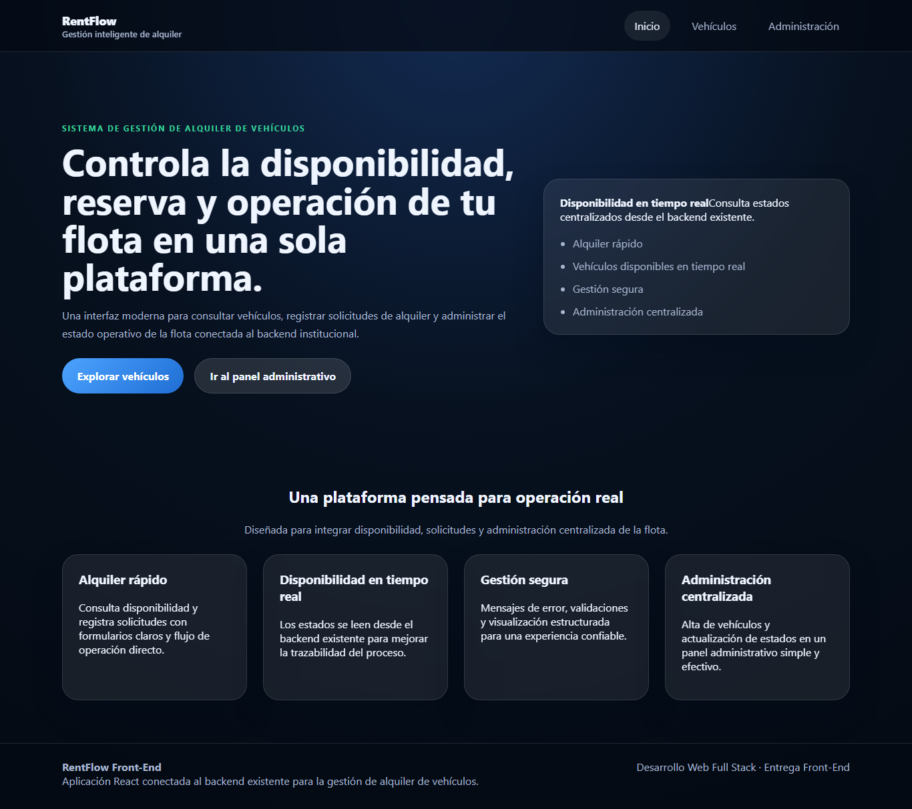
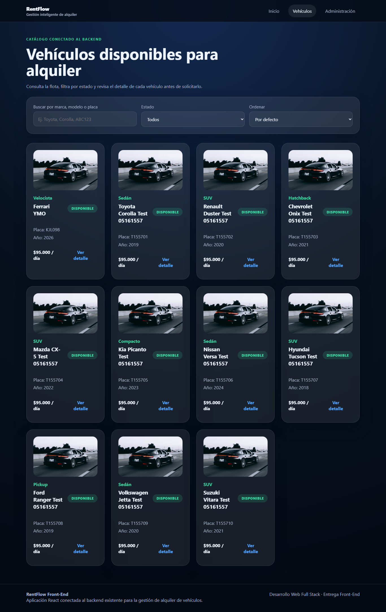
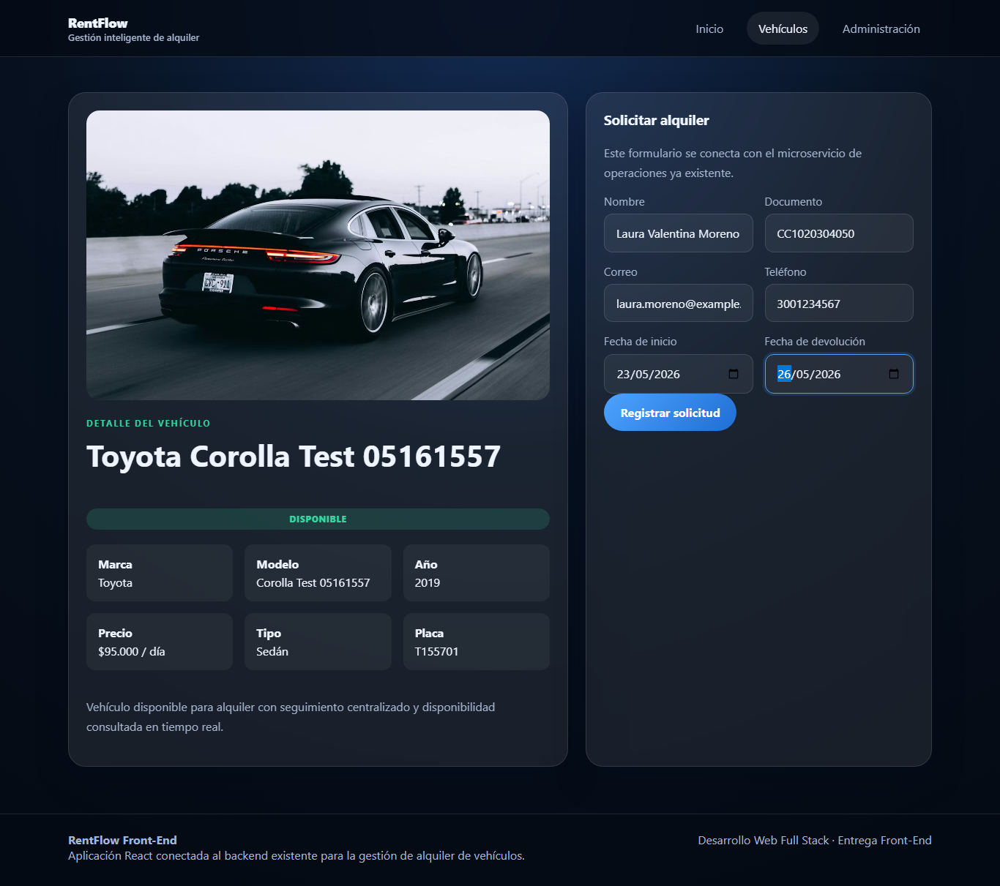
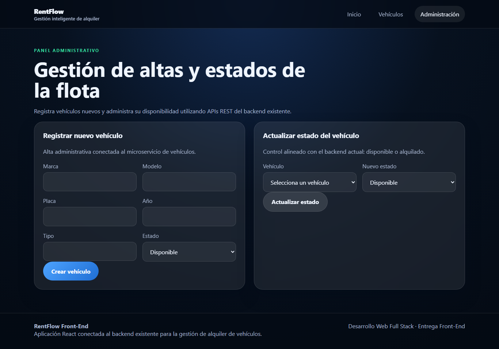
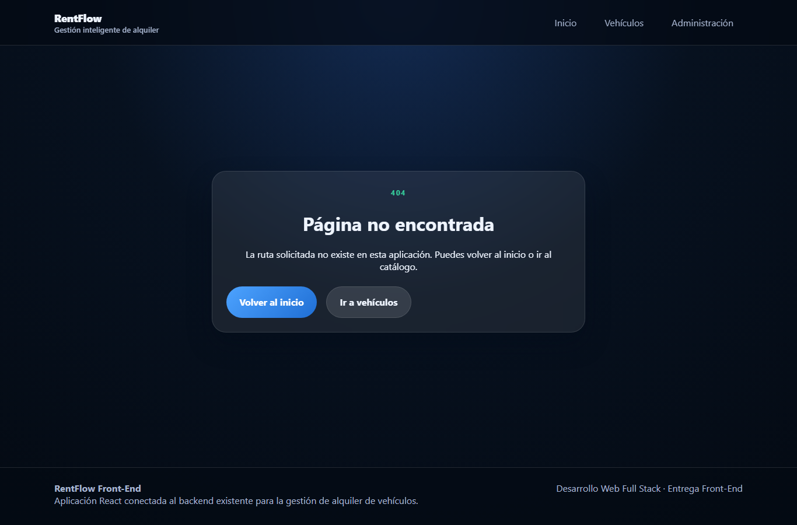
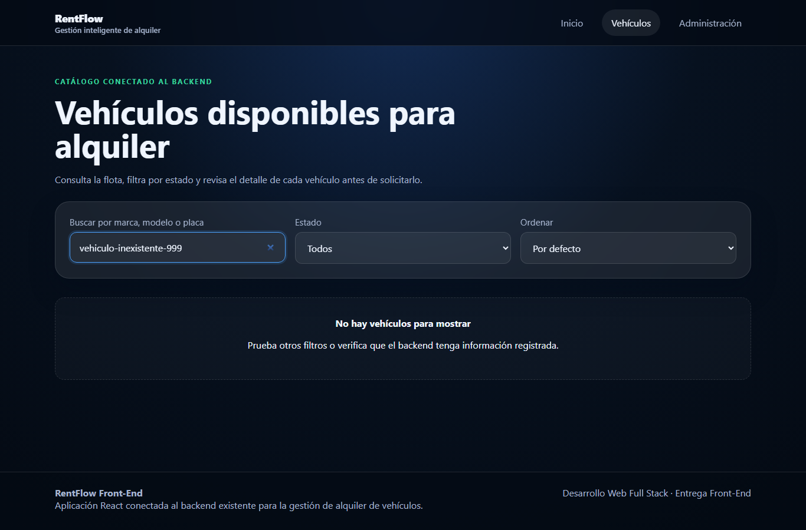
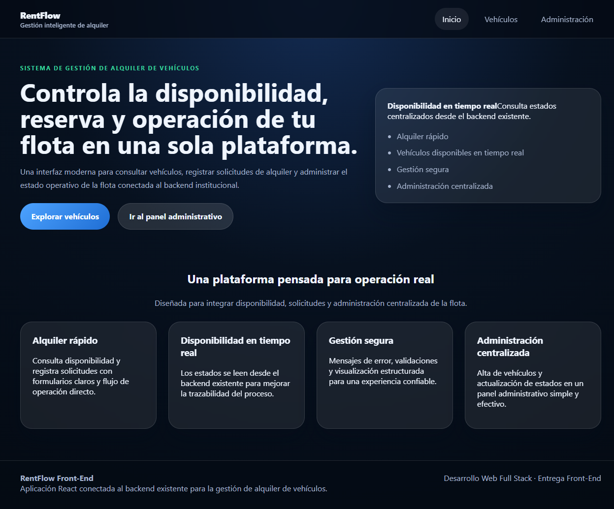
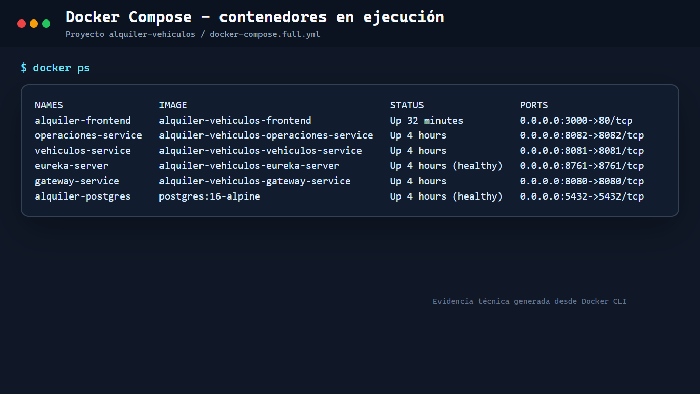
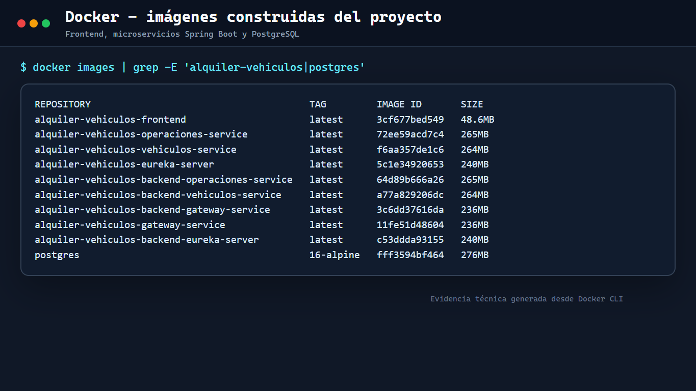

# 1. Portada

**Sistema de Gestión de Alquiler de Vehículos**  
**Memoria Técnica del Front-End con enfoque de ingeniería de software**  

Asignatura: Desarrollo Web Full Stack  
Tecnologías principales: React, Vite, React Router, Axios, CSS  
Tipo de documento: Memoria técnica académica  
Año: 2026  

---

# 2. Índice

1. Portada  
2. Índice  
3. Introducción  
4. Componentes de React  
5. Hooks utilizados  
6. Vistas  
7. Consumo de APIs REST  
8. Conclusiones  

---

# 3. Introducción

El presente documento describe el diseño e implementación del Front-End del sistema de gestión de alquiler de vehículos, desarrollado en React e integrado con un backend preexistente basado en microservicios. Desde una perspectiva de ingeniería de software, la solución fue planteada para resolver cuatro necesidades funcionales concretas: consulta de la flota, inspección detallada de vehículos, registro de solicitudes de alquiler y administración del inventario mediante creación y actualización de estados.

La aplicación se estructuró bajo un enfoque modular orientado a separación de responsabilidades. Para ello, se definieron capas diferenciadas de navegación, presentación, acceso a datos y lógica reutilizable. Esta organización permite reducir acoplamiento entre componentes, mejorar la mantenibilidad del código y facilitar futuras extensiones funcionales.

En el plano tecnológico, se utilizó React como librería principal de interfaz, Vite como herramienta de construcción y ejecución, React Router para la resolución de rutas, Axios para la comunicación HTTP con el backend y CSS para la definición del comportamiento visual de la interfaz. Adicionalmente, se incorporaron hooks nativos y hooks personalizados para encapsular reglas de estado, carga, filtrado y consulta de datos.

Desde el punto de vista funcional, el Front-End implementa un flujo completo de interacción con el sistema: consulta de vehículos, visualización de detalle por identificador, registro de solicitudes, alta de vehículos y actualización de disponibilidad. Se añadieron además mecanismos de soporte de experiencia de usuario, como mensajes de error, estados de carga y manejo de ausencia de resultados.

Durante la etapa de integración se detectó una incidencia temporal en el enrutamiento del API Gateway. En consecuencia, y con el objetivo de asegurar continuidad funcional, la aplicación quedó configurada para consumir directamente los microservicios expuestos de vehículos y operaciones. Esta decisión no altera el cumplimiento del requerimiento funcional del Front-End, pero sí constituye una observación técnica relevante dentro de la arquitectura de integración.

---

# 4. Componentes de React

La construcción de la interfaz se realizó mediante componentes funcionales de React. Este enfoque permite encapsular comportamiento, presentación y reutilización de manera controlada, alineándose con prácticas modernas de desarrollo Front-End.

## Navbar

Componente responsable de la navegación principal del sistema. Centraliza el acceso a las vistas estratégicas de la aplicación, manteniendo consistencia de interacción y reduciendo dispersión en el flujo de usuario.

## HeroSection

Componente ubicado en la página principal. Su función es presentar el propósito del sistema, contextualizar la solución y comunicar visualmente las capacidades principales de la plataforma.

## VehicleCard

Unidad de presentación reutilizable encargada de representar la información resumida de un vehículo dentro del catálogo. Aísla la visualización de atributos clave y favorece la escalabilidad del renderizado del listado.

## VehicleGrid

Componente contenedor que organiza múltiples instancias de `VehicleCard` en una disposición de cuadrícula adaptable. Mejora la legibilidad visual y permite desacoplar la lógica de renderizado estructural de la lógica de datos.

## VehicleFilters

Componente orientado a interacción. Permite aplicar criterios de búsqueda, filtrado por estado y ordenamiento. Su propósito es ofrecer control sobre la exploración del conjunto de datos sin trasladar esa complejidad a la capa de presentación principal.

## StatusBadge

Componente reutilizable para representar el estado operativo de un vehículo. Facilita la lectura semántica de disponibilidad mediante indicadores visuales consistentes en distintas vistas del sistema.

## LoadingSpinner

Componente de retroalimentación visual mostrado durante operaciones asíncronas. Su función es comunicar al usuario que existe una consulta o transacción en curso, evitando ambigüedad en la experiencia de uso.

## ErrorMessage

Componente destinado a la visualización controlada de errores. Encapsula la presentación de fallos de red, validación o backend, proporcionando mensajes claros y, cuando aplica, opciones de reintento.

## RentalForm

Componente de captura de datos orientado al registro de solicitudes de alquiler. Implementa el flujo de entrada, validación básica y envío de información hacia el microservicio de operaciones.

## AdminVehicleForm

Componente de administración para registrar nuevos vehículos en el sistema. Representa la funcionalidad de alta dentro del panel administrativo y canaliza la comunicación hacia el servicio correspondiente.

## VehicleStatusControl

Componente orientado a la actualización del estado de vehículos existentes. Permite intervenir la disponibilidad operativa de la flota desde el panel administrativo, alineado con la funcionalidad exigida en el requerimiento.

## Footer

Componente estructural de cierre visual. Proporciona consistencia entre vistas y contribuye a la cohesión global de la interfaz.

En conjunto, la solución implementa más de diez componentes funcionales, superando el mínimo exigido por el requerimiento y evidenciando una arquitectura de interfaz basada en reutilización y división controlada de responsabilidades.

---

# 5. Hooks utilizados

La aplicación emplea hooks de React como mecanismo principal de gestión de estado, efectos secundarios y reutilización de lógica. Este enfoque reduce duplicidad, mejora legibilidad y favorece el desacoplamiento entre la capa visual y la lógica de interacción con datos.

## useState

Se utilizó para administrar estados locales en componentes y hooks personalizados. Entre los casos de uso más relevantes se encuentran el almacenamiento de colecciones de vehículos, el control de filtros, el registro de estados de carga, el manejo de errores y la captura de datos en formularios. Su aplicación garantiza reactividad de la interfaz ante cambios del usuario o respuestas del backend.

## useEffect

Se implementó para gestionar efectos secundarios asociados a la carga de información desde los microservicios. Su uso permitió ejecutar consultas iniciales al montar vistas específicas y sincronizar el contenido visual con parámetros de navegación, como el identificador del vehículo en la vista de detalle.

## useCallback

Se utilizó para encapsular funciones de consulta y refresco de datos con referencias estables. Esto mejora la composición con otros hooks y evita recreaciones innecesarias en ciclos de renderizado donde la lógica depende de funciones reutilizadas.

## useMemo

Se incorporó para optimizar operaciones derivadas sobre la colección de vehículos, especialmente en procesos de filtrado y ordenamiento. Este hook evita cálculos redundantes cuando las dependencias no presentan cambios, favoreciendo eficiencia en la renderización.

## Custom hook `useVehicles()`

Este hook abstrae la lógica de obtención, almacenamiento, filtrado, ordenamiento y refresco de la lista de vehículos. Además, concentra los estados de carga y error relacionados con la consulta del catálogo. Desde un punto de vista de ingeniería, su valor principal radica en desacoplar la lógica de negocio visual de la implementación de las páginas que consumen esa información.

## Custom hook `useVehicleDetail(id)`

Este hook encapsula la consulta de un vehículo específico a partir de su identificador. Administra el estado del recurso recuperado, el loading, los errores y la recarga del detalle. Su implementación simplifica la vista de detalle y promueve reutilización de lógica asociada a este caso de uso.

La presencia de hooks básicos y custom hooks evidencia cumplimiento del requerimiento y una aplicación correcta de patrones de composición en React.

---

# 6. Vistas

La navegación del sistema fue implementada con React Router, estructurando la aplicación en rutas orientadas a los principales casos de uso definidos por el requerimiento.

Las siguientes evidencias visuales fueron tomadas con el Front-End ejecutándose en ambiente local, conectado a los microservicios disponibles y utilizando datos de prueba reales del catálogo. Las capturas se incorporan en la sección funcional correspondiente para conservar concordancia entre explicación técnica, flujo de usuario y resultado visual observado.

## Página principal (`/`)

Corresponde a la vista de entrada del sistema. Su objetivo es presentar el contexto funcional de la plataforma y orientar al usuario hacia las capacidades principales del Front-End. Incluye una cabecera de navegación, una sección principal de presentación y bloques informativos que resumen los beneficios operativos del sistema.

**Evidencia visual:** vista inicial del sistema en ejecución, incluyendo navegación superior, bloque hero, llamados a la acción y secciones informativas de beneficios.



*Figura 1. Página principal del Front-End en ejecución. La captura evidencia la estructura de entrada del sistema, la navegación global y la presentación funcional de la plataforma.*

## Listado de vehículos (`/vehiculos`)

Esta vista implementa el caso de uso de consulta de la flota. Presenta un conjunto de vehículos obtenidos desde el backend y ofrece mecanismos de filtrado y ordenamiento. También integra estados de carga, error y ausencia de resultados, lo que mejora robustez funcional frente a escenarios variables de disponibilidad de datos.

**Evidencia visual:** catálogo de vehículos conectado al backend, con filtros de búsqueda, selección por estado, ordenamiento y tarjetas de vehículos renderizadas a partir de datos reales.



*Figura 2. Listado de vehículos consumido desde el microservicio de vehículos. Se observa la cuadrícula de tarjetas, los controles de filtrado y la consistencia visual del catálogo.*

## Detalle del vehículo (`/vehiculos/:id`)

Esta vista resuelve la necesidad de inspección detallada de un recurso específico. Muestra atributos relevantes del vehículo, como marca, modelo, placa, tipo, año, precio y estado. Además, concentra el contexto necesario para iniciar una solicitud de alquiler desde la misma pantalla.

**Evidencia visual:** detalle individual de un vehículo obtenido por identificador, con atributos operativos y formulario lateral asociado al proceso de solicitud.


*Figura 3. Vista de detalle de vehículo. La captura muestra la recuperación individual del recurso, la presentación de atributos normalizados y el estado operativo del vehículo.*

## Formulario de solicitud de alquiler

Aunque forma parte de la vista de detalle, cumple un rol funcional autónomo. Permite capturar la información del cliente y del periodo de alquiler, enviando posteriormente estos datos al microservicio de operaciones. Este componente representa la transición entre consulta de catálogo y ejecución de una operación de negocio.

**Evidencia visual:** formulario diligenciado con datos de prueba antes del envío al microservicio de operaciones. La captura permite validar la estructura de campos, jerarquía visual y alineación del componente dentro del flujo de detalle.



*Figura 4. Formulario de solicitud de alquiler. Se evidencia el flujo de captura de cliente, documento, contacto y fechas de alquiler, manteniendo integración visual con la vista de detalle.*

## Panel administrativo (`/admin`)

Esta vista implementa la funcionalidad de administración definida en el requerimiento. Su estructura integra dos operaciones clave: el registro de nuevos vehículos y la actualización de estados de la flota existente. Desde la perspectiva de ingeniería, centraliza operaciones de mantenimiento de datos dentro de una interfaz coherente y separada del flujo de consulta de usuario final.

**Evidencia visual:** panel administrativo en ejecución, compuesto por el formulario de alta de vehículos y el módulo para modificar el estado operativo de unidades existentes.



*Figura 5. Panel administrativo. La captura evidencia la separación entre operaciones de creación y actualización de estado, manteniendo una organización clara para tareas de mantenimiento de flota.*

## Página no encontrada (`*`)

Se implementó una ruta de control para solicitudes de navegación no válidas. Esta vista mejora resiliencia de la aplicación al proporcionar una salida controlada ante rutas inexistentes y preservar consistencia de experiencia.

**Evidencia visual:** ruta inexistente controlada por React Router, con mensaje de error, navegación de retorno al inicio y acceso al catálogo.



*Figura 6. Página no encontrada. La captura muestra el manejo controlado de rutas inválidas y la preservación de alternativas de navegación para el usuario.*

## Estados de apoyo visual

Además de las vistas principales, el sistema incorpora estados auxiliares de carga, error y vacío. Estos estados fortalecen la calidad de interacción y permiten comunicar de forma explícita la condición operativa de cada consulta o transacción.

**Evidencia visual:** estado vacío del catálogo generado mediante una búsqueda sin coincidencias. Este comportamiento confirma que la interfaz responde de forma controlada ante consultas sin resultados.



*Figura 7. Estado vacío del listado. La captura evidencia el tratamiento visual de ausencia de resultados, evitando pantallas ambiguas y conservando una salida comprensible para el usuario.*

## Evidencia de ejecución dockerizada

Adicionalmente, se documentó la ejecución del sistema en entorno contenedorizado mediante Docker Compose. Esta evidencia permite comprobar que el Front-End fue construido como imagen Docker, publicado en el puerto configurado y ejecutado junto con los microservicios del backend y la base de datos PostgreSQL.

**Evidencia visual:** Front-End ejecutándose desde el contenedor `alquiler-frontend`, expuesto localmente en `http://localhost:3000` y servido desde Nginx según la configuración del `Dockerfile` del Front-End.



*Figura 8. Front-End dockerizado en ejecución. La captura muestra la aplicación publicada desde el contenedor, validando el despliegue web del sistema fuera del servidor de desarrollo de Vite.*

**Evidencia visual:** contenedores activos del proyecto, incluyendo Front-End, microservicios Spring Boot, servidor Eureka, gateway y PostgreSQL.



*Figura 9. Contenedores Docker en ejecución. La captura evidencia los servicios levantados mediante Docker Compose, sus nombres, imágenes asociadas, estado operativo y puertos publicados.*

**Evidencia visual:** imágenes Docker construidas para los componentes del sistema, junto con la imagen oficial de PostgreSQL utilizada como servicio de persistencia.



*Figura 10. Imágenes Docker del proyecto. La captura confirma la construcción de las imágenes correspondientes al Front-End y a los microservicios principales, además de la disponibilidad de la imagen base de PostgreSQL.*

La aplicación cumple el requerimiento mínimo de rutas y, además, añade una ruta de control para mejorar robustez de navegación. De igual forma, las evidencias de Docker confirman que el sistema puede ejecutarse de manera contenedorizada, integrando servicios de presentación, lógica de negocio, descubrimiento, gateway y persistencia.

---

# 7. Consumo de APIs REST

La comunicación con el backend se implementó mediante Axios, encapsulando el acceso HTTP en una capa de servicios reutilizables ubicada en `src/api/`. Esta decisión permite desacoplar la lógica de integración respecto de la capa visual y facilita mantenimiento, pruebas y evolución futura.

## Configuración de conectividad

La aplicación utiliza una variable de entorno para definir la URL base del Gateway/API única consumida por el Front-End:

```env
VITE_API_BASE_URL=/api
# Opcional para desarrollo directo:
# VITE_API_BASE_URL=http://localhost:8080/api
```

Este mecanismo permite modificar el entorno de ejecución sin alterar la lógica interna del código, favoreciendo portabilidad y despliegue controlado a través del Gateway.

## Servicio `vehicleService.js`

Este módulo encapsula la interacción con el microservicio de vehículos. Implementa un cliente HTTP con configuración base, timeout y encabezados apropiados para operaciones JSON. También incorpora una función de normalización para homogeneizar los datos recibidos y un mecanismo centralizado de manejo de errores.

Las operaciones implementadas son las siguientes:

- `getVehicles()` para recuperar la colección general de vehículos.
- `getAvailableVehicles()` para consultar específicamente los vehículos disponibles.
- `getVehicleById(id)` para recuperar el detalle de un vehículo específico.
- `createVehicle(payload)` para registrar un nuevo vehículo.
- `updateVehicleStatus(id, estado)` para modificar el estado operativo de un vehículo.

## Servicio `rentalService.js`

Este módulo encapsula la interacción con el microservicio de operaciones. Su función principal es gestionar la creación y consulta de solicitudes de alquiler. La capa transforma los datos del formulario al formato esperado por el backend y delega la ejecución de la petición al cliente HTTP configurado.

Las operaciones implementadas son:

- `createRentalRequest(payload)` para registrar una nueva solicitud de alquiler.
- `getRentalRequests()` para consultar solicitudes previamente registradas.

## Estrategia de integración

El flujo de consumo sigue una arquitectura simple pero correcta para el nivel del proyecto:

1. La vista o componente dispara una acción de usuario o carga inicial.
2. Un hook personalizado centraliza la lógica de consulta.
3. El hook invoca una función del servicio correspondiente.
4. El servicio ejecuta la petición HTTP con Axios.
5. La respuesta se transforma, se almacena en estado local y se refleja en la interfaz.
6. Si ocurre un error, este se propaga de forma controlada hacia la capa visual.

Este diseño minimiza acoplamiento entre presentación y comunicación remota, además de facilitar reutilización de llamadas desde distintas vistas.

## Observaciones técnicas relevantes

Aunque la arquitectura objetivo contempla el uso de un API Gateway como punto único de acceso, durante la validación se identificó una incidencia temporal en el enrutamiento hacia `vehiculos-service`. Por esta razón, el Front-End fue configurado para consumir directamente `vehiculos-service` y `operaciones-service`, manteniendo la funcionalidad exigida por el requerimiento.

Adicionalmente, se detectó que el backend soporta únicamente los estados `DISPONIBLE` y `NO_DISPONIBLE`. En consecuencia, la interfaz administrativa fue ajustada para evitar el envío de estados no implementados, reduciendo así fallos en ejecución y preservando consistencia funcional entre cliente y servidor.

## Cumplimiento del requerimiento de integración

La solución implementa efectivamente las operaciones exigidas:

- consulta del listado de vehículos,
- consulta de detalle por identificador,
- registro de solicitudes de alquiler,
- actualización de estado de un vehículo.

Por tanto, el consumo de APIs REST no solo está presente, sino organizado de forma técnicamente coherente con una arquitectura Front-End modular.

---

# 8. Conclusiones

El Front-End desarrollado para el sistema de gestión de alquiler de vehículos cumple con los requerimientos funcionales, estructurales y tecnológicos planteados en la actividad académica. La solución implementa React como base de interfaz, emplea componentes funcionales, hooks nativos y hooks personalizados, integra rutas con React Router y consume APIs REST mediante una capa dedicada de servicios.

Desde la perspectiva de ingeniería, uno de los principales aciertos del proyecto es la separación explícita entre presentación, navegación, lógica reutilizable y acceso a datos. Esta organización reduce complejidad accidental, mejora mantenibilidad y permite escalar el sistema con nuevas funcionalidades sin comprometer la estructura existente.

En el plano funcional, la aplicación cubre de extremo a extremo los escenarios solicitados: visualización del catálogo, detalle por vehículo, registro de solicitudes, creación de vehículos y actualización de estados. A esto se suma el tratamiento de estados de carga, error y vacío, lo cual fortalece la calidad operativa de la interfaz.

En el plano de integración, la utilización de Axios, variables de entorno y servicios encapsulados proporciona una base robusta para evolucionar la comunicación con el backend. Si en etapas posteriores se estabiliza completamente el gateway, el sistema puede reconfigurarse sin cambios estructurales profundos en la interfaz.

En conclusión, la solución entrega un Front-End técnicamente sólido para el alcance requerido, con una organización alineada con buenas prácticas de desarrollo y con capacidad razonable de evolución futura.

**Nota final:** este documento debe exportarse finalmente a **PDF** para cumplir con el formato de entrega establecido en el requerimiento académico.
